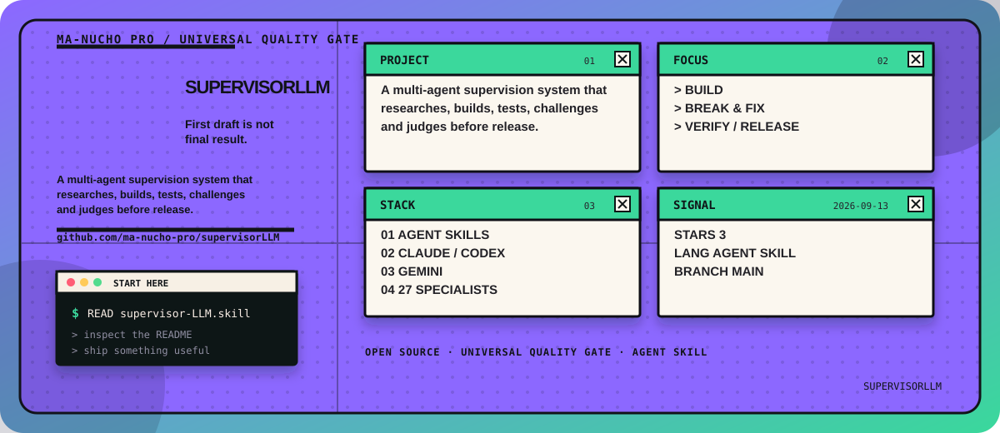

<!-- manucho-readme-banner:start -->

  

<!-- manucho-readme-banner:end -->

  

# SUPERVISORLLM

First draft is not final result.

A multi-agent supervision system that researches, builds, tests, challenges and judges before release.

## Focus

- Build
- Break & Fix
- Verify / Release

## Start

SUPERVISORLLM
